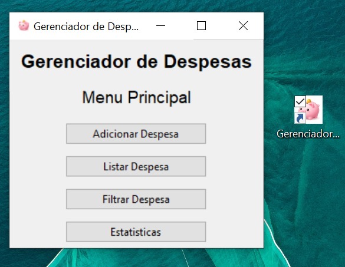

# 💰 Gerenciador de Despesas

Aplicação desenvolvida em Python com interface gráfica utilizando Tkinter, voltada para controle e organização de despesas pessoais.

O projeto evoluiu de uma versão inicial em terminal para uma aplicação com interface gráfica e executável funcional.

⸻

## 🚀 Funcionalidades

	•	✅ Adicionar despesas
	•	📋 Listar registros
	•	🔎 Filtrar despesas
	•	📊 Visualizar estatísticas
	•	🖥 Interface gráfica construída com Tkinter
	•	📦 Versão executável gerado para uso local

⸻

## 🛠 Tecnologias Utilizadas

	•	Python 3
	•	Tkinter (GUI)
	•	Estrutura modular com separação entre lógica e interface

⸻

## 📷 Interface

⸻

## ▶️ Como executar

Executar pelo código
	1.	Clone o repositório:
 '''bash
 git clone https://github.com/BrianSato/gerenciador-despesas-cli.git
 '''
 2.	Acesse a pasta do projeto
	3.	Execute o arquivo principal:
 '''bash
 python nome_do_arquivo_principal.py
 '''
 
⸻

 ## 📌 Objetivo do Projeto

Este projeto foi desenvolvido com o objetivo de consolidar conhecimentos em:
	•	Estruturação de projetos
	•	Separação de responsabilidades
	•	Construção de interfaces gráficas com Tkinter
	•	Evolução incremental de software

⸻

# 👨‍💻 Autor

Desenvolvido por Brian Sato.

 
